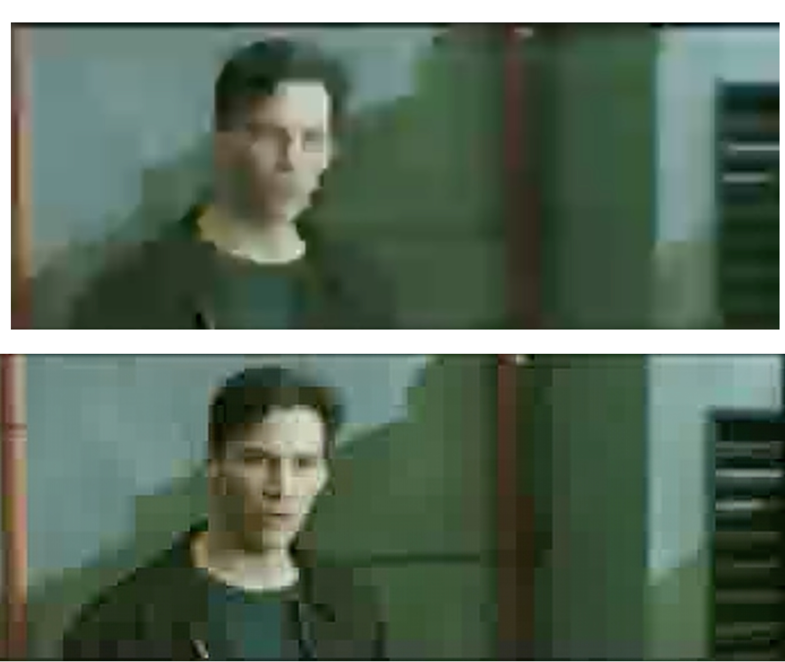
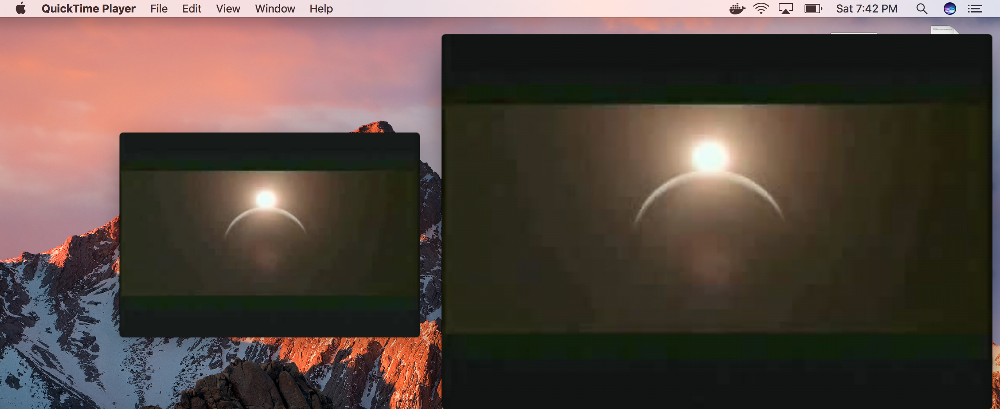
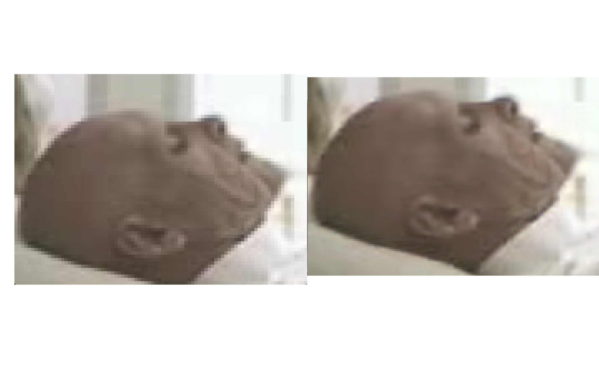
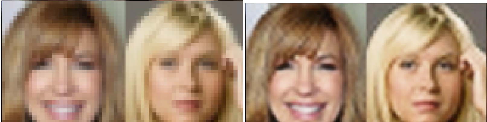

# DeepRes

Uses Deep learning and sub-pixel convolutional nets to create High(er) resolution videos from low(er) resolution videos

The Top frame is the input/original, the bottom frame is the output frame.

## How To run (Tested on MacOS Sierra CPU)

### Make Sure To Edit the MainScript.py for your settings

After Editing the MainScript.py

```
python3.5 MainScript.py
```
## How to include audio(Not Tested)

Normally the audio is not added as a feature, but it can be done easily.Although if you want audio, the framerate of the video must match the framerate varible in the ``` MainScript.py ```. To get the fps:
First install moviepy(http://zulko.github.io/moviepy/)
Then in ```MainScript.py```
```
import os
from moviepy.editor import *
EnhancePyDir = " /Users/USERNAME/Downloads/DeepRes/enhance.py"
videoDirectory = "/Users/USERNAME/Downloads/ATEST.mp4"
OutPutFileDirBefore = "/Users/aneeshmuppidi/out1"
OutPutFileDirAfter = "/Users/aneeshmuppidi/out2"
clip = VideoFileClip(videoDirectory)
ClipFPS = clip.fps
FrameRate =  str(ClipFPS)
AudioOutputFileName = "/Users/USERNAME/audio" 
Filename = "filename"
Dir = " ATEST/"
DirectoryToSave = Dir + Filename + "%03d.jpg"
DirectoryToSaveX = Dir +Filename + "%03d_ne2x.png"
command = "ffmpeg -i " + videoDirectory + " -vn -acodec copy " + AudioFileName +".aac"
os.system(command)
command1 = "ffmpeg -i " + videoDirectory + " -r " + FrameRate + DirectoryToSave
os.system(command1)

command3 = "python3.5" + EnhancePYDir + " --zoom=2" + Dir + "*.jpg"
os.system(command3)
command4 = "avconv -framerate 15 -f image2 -i " + DirectoryToSave + "  -b 65536k " + OutPutFileDirBefore + ".mov"
os.system(command4)
command5 = "avconv -framerate 15 -f image2 -i " + DirectoryToSaveX +  " -b 65536k " + OutPutFileDirAfter + ".mov"
os.system(command5)
command6 = "ffmpeg -i " + videoDirectory + " -i " + AudioOutputFileName + " \ "
os.system(command6)
command7 = "-c:v copy -c:a aac -strict experimental " + OutPutFileDirAfter + "WithAudio.mp4 "


```


## Requirements python3.5(MUST) 


```
colorama
```
```
pillow>=3.2.0
```
```
Theano==0.8.2
```


```
Lasagne  (https://github.com/Lasagne/Lasagne.git@61b1ad1#egg=Lasagne==0.2-dev)
```
```
Homebrew
```
```
Scipy
```

## How to install FFMpeg and Libav

brew install libav

brew install ffmpeg



The Model  upscales the Video by 2x at the exact same resolution!

## Examples Note: The FPS of the videos were purposely decreased drastically, because the time that the model was being built had a time  limit (hackathon) the higher FPS the more quality the results will be. : 

One frame Comparison : 


One frame example(After 10 epochs) : 

# The orignal Video was Higher Res Than the input, but I converted to a low res video, for the input of the Model.... So you can see the model's power converting very low res videos to High-Res

Before Super Resolution Model  :   https://www.youtube.com/watch?v=-H7Oba1H00s

After Super Resolution Model  : https://www.youtube.com/watch?v=v5yBOTp5M9M


## Download The youtube videos to see results, very hard to see through Youtube.  (http://youtubeinmp4.com)


